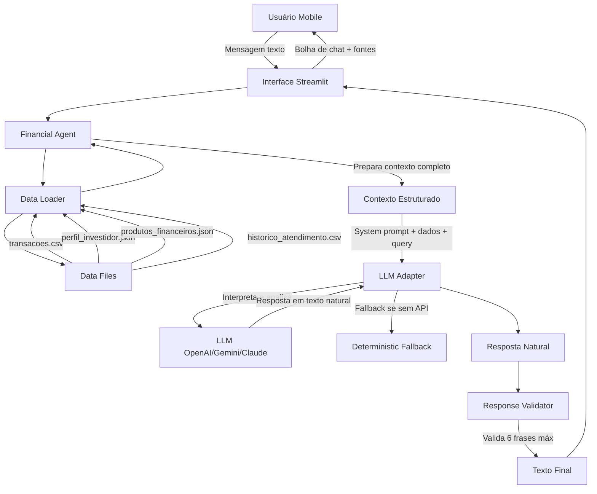

# Documentação do Agente

## Caso de Uso

### Problema
O gerenciamento financeiro pessoal pode ser complexo e demorado. Muitas pessoas não percebem padrões de gastos problemáticos, perdem oportunidades de economia e têm dificuldade em planejar metas financeiras de forma realista. Além disso, a linguagem técnica do setor financeiro pode ser intimidadora e interfaces complexas afastam usuários.

### Solução
Moara (MOARA – Modular Orchestrated AI for Responsible Advisory) é um agente financeiro proativo que utiliza IA generativa controlada para análise de dados e geração de respostas, oferecendo clareza e transparência na gestão financeira. Moara monitora automaticamente os gastos do usuário, identifica padrões e oportunidades de melhoria, e oferece orientação personalizada de forma simples e direta. Com uma interface mobile-first inspirada no WhatsApp, Moara torna a gestão financeira acessível e conveniente, com respostas concisas (máximo 6 frases) adequadas para consulta rápida no celular.

### Público-Alvo
Pessoas com renda estabelecida que desejam melhorar sua gestão financeira mas não têm tempo ou conhecimento técnico aprofundado. Especialmente usuários mobile que preferem interações rápidas e diretas, similares a apps de mensagem.

---

## Persona e Tom de Voz

### Nome do Agente
**Moara** (MOARA – Modular Orchestrated AI for Responsible Advisory)

### Personalidade
- **Consultiva**: Oferece orientação baseada em dados, não ordens
- **Objetiva**: Vai direto ao ponto, sem rodeios
- **Proativa**: Antecipa necessidades e alerta sobre problemas
- **Transparente**: Sempre indica a fonte das informações
- **Segura**: Admite limitações quando não tem dados suficientes

### Tom de Comunicação
- **Profissional mas acessível**: Linguagem clara, sem jargões
- **Conciso**: Respostas principais com máximo 6 frases (2-3 parágrafos curtos)
- **Sem emojis**: Mantém seriedade apropriada ao contexto financeiro
- **Direto**: Sem explicações longas a menos que solicitado

### Exemplos de Linguagem
- Saudação: "Olá, João. Estou aqui para ajudar com suas finanças. Como posso ajudar hoje?"
- Confirmação: "Analisando seus dados. Um momento."
- Erro/Limitação: "Dados insuficientes para essa análise. Adicione mais transações para continuar."
- Alerta: "Seus gastos aumentaram 35% nos últimos 7 dias. Pode ser um bom momento para revisar o orçamento."

---

## Arquitetura

### Diagrama

### Componentes

| Componente | Descrição | Tecnologia |
|------------|-----------|------------|
| Interface | Chat mobile-first com bolhas estilo WhatsApp | Streamlit |
| Financial Agent | Prepara dados financeiros e coordena com LLM para análise | Python |
| LLM Adapter | Interface para múltiplos provedores de LLM com fallback | OpenAI/Gemini/Claude (opcional) |
| Response Validator | Valida limite de 6 frases nas respostas | Python (regex) |
| Data Loader | Carrega e valida schema dos dados mockados | Pandas |
| Data Files | Arquivos CSV/JSON com dados do usuário | Filesystem |

### Fluxo de Dados

1. **Inicialização**: Data Loader carrega e valida arquivos em `/data`
2. **Query do usuário**: Mensagem digitada na interface de chat
3. **Preparação de contexto**: Agent formata todos os dados (transações, perfil, histórico, produtos) em texto estruturado
4. **Análise pelo LLM**: LLM Adapter envia system prompt + dados + pergunta para o provedor configurado
5. **Interpretação livre**: LLM analisa todos os dados disponíveis e interpreta a pergunta do usuário de forma dinâmica
6. **Geração de resposta**: LLM gera resposta em texto natural baseada exclusivamente nos dados fornecidos
7. **Validação**: Response Validator garante máximo 6 frases (2-3 parágrafos curtos)
8. **Extração de fontes**: Sistema identifica quais arquivos de dados foram relevantes para a resposta
9. **Exibição**: Interface mostra resposta com justificativa e fontes
10. **Detalhes opcionais**: Usuário pode clicar para ver informações estendidas

### Uso de IA Generativa

**Importante**: O projeto utiliza IA generativa (LLM) de forma **responsável e controlada**:

- **LLM para análise dinâmica**: O LLM recebe todos os dados financeiros e interpreta livremente a pergunta do usuário, sem estar limitado a intenções pré-definidas
- **Respostas baseadas em dados**: System prompt restritivo garante que o LLM use APENAS informações presentes nos dados fornecidos
- **Sem invenção de dados**: Regras explícitas no prompt proíbem o LLM de inventar valores, transações ou produtos
- **Validação de tamanho**: Sistema valida que respostas sejam concisas (máximo 6 frases para UX mobile)
- **Fallback determinístico**: O sistema funciona sem LLM, usando matching de palavras-chave e respostas pré-formatadas
- **Governança**: System prompt do LLM é restritivo, proibindo criação de informações além das fornecidas

Esta arquitetura garante:
- ✅ Flexibilidade para interpretar qualquer pergunta sobre os dados
- ✅ Zero alucinação de valores monetários através de prompt engineering
- ✅ Transparência total (fontes sempre documentadas)
- ✅ Funcionamento com ou sem API de LLM
- ✅ Análise dinâmica sem limitação a 5-6 tipos de resposta fixos

---

## Segurança e Anti-Alucinação

### Estratégias Adotadas

- [x] Agente opera **exclusivamente** com dados fornecidos em `/data`
- [x] System prompt **restritivo** proíbe LLM de criar informações além dos dados
- [x] Respostas incluem **fonte explícita** (arquivo utilizado)
- [x] Quando não há dados suficientes, admite limitação claramente
- [x] Não faz recomendações de investimento sem perfil do cliente
- [x] **Validação automática** de tamanho de resposta (max 6 frases)
- [x] **Fallback determinístico** quando LLM não disponível
- [x] Não promete rentabilidade ou retornos
- [x] Todas as respostas baseadas exclusivamente em dados fornecidos

### Mecanismo de Validação de Resposta

O `ResponseValidator` implementa verificação automática:
- Conta sentenças usando regex para `.!?`
- Trunca respostas que excedem 6 frases (aproximadamente 2-3 parágrafos curtos)
- Preserva a resposta completa para exibição em "Ver detalhes"

Este mecanismo garante experiência mobile-first consistente enquanto permite análises mais detalhadas quando solicitado.

### Limitações Declaradas

#### O que Moara NÃO faz:
- ❌ Não executa operações financeiras reais
- ❌ Não acessa contas bancárias ou cartões
- ❌ Não promete rentabilidade específica de investimentos
- ❌ Não compartilha dados entre diferentes usuários
- ❌ Não responde sobre temas não-financeiros
- ❌ Não inventa dados quando não estão disponíveis
- ❌ Não recomenda produtos sem considerar perfil do investidor

#### Quando Moara não pode responder:
- Dados insuficientes em `/data` para a análise solicitada
- Query fora do escopo financeiro definido
- Informações sobre produtos não presentes em `produtos_financeiros.json`