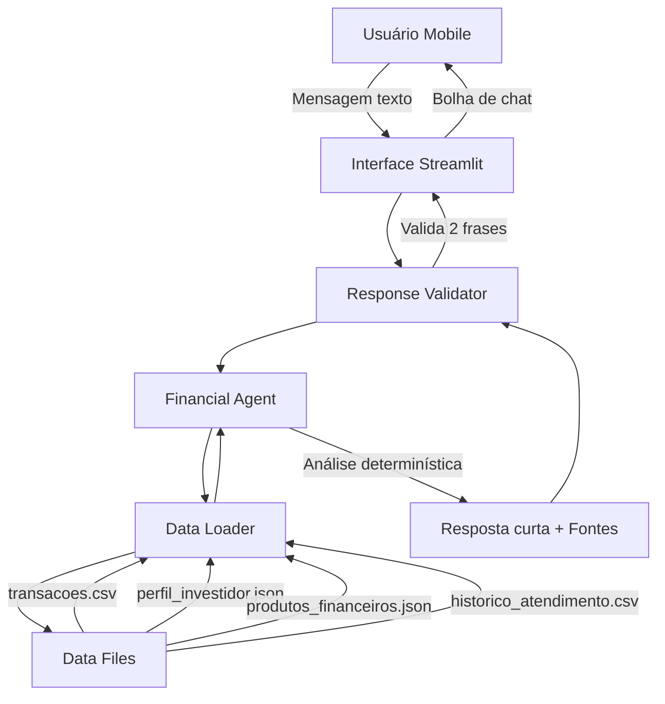

# Documentação do Agente

## Caso de Uso

### Problema
O gerenciamento financeiro pessoal pode ser complexo e demorado. Muitas pessoas não percebem padrões de gastos problemáticos, perdem oportunidades de economia e têm dificuldade em planejar metas financeiras de forma realista. Além disso, a linguagem técnica do setor financeiro pode ser intimidadora e interfaces complexas afastam usuários.

### Solução
Bia é um agente financeiro proativo que monitora automaticamente os gastos do usuário, identifica padrões e oportunidades de melhoria, e oferece orientação personalizada de forma simples e direta. Com uma interface mobile-first inspirada no WhatsApp, Bia torna a gestão financeira acessível e conveniente, com respostas curtas (máximo 2 frases) adequadas para consulta rápida no celular.

### Público-Alvo
Pessoas com renda estabelecida que desejam melhorar sua gestão financeira mas não têm tempo ou conhecimento técnico aprofundado. Especialmente usuários mobile que preferem interações rápidas e diretas, similares a apps de mensagem.

---

## Persona e Tom de Voz

### Nome do Agente
**Bia** (diminutivo de "Bem-vinda", simbolizando acolhimento financeiro)

### Personalidade
- **Consultiva**: Oferece orientação baseada em dados, não ordens
- **Objetiva**: Vai direto ao ponto, sem rodeios
- **Proativa**: Antecipa necessidades e alerta sobre problemas
- **Transparente**: Sempre indica a fonte das informações
- **Segura**: Admite limitações quando não tem dados suficientes

### Tom de Comunicação
- **Profissional mas acessível**: Linguagem clara, sem jargões
- **Conciso**: Respostas principais com máximo 2 frases
- **Sem emojis**: Mantém seriedade apropriada ao contexto financeiro
- **Direto**: Sem explicações longas a menos que solicitado

### Exemplos de Linguagem
- Saudação: "Olá, João. Estou aqui para ajudar com suas finanças. Como posso ajudar hoje?"
- Confirmação: "Analisando seus dados. Um momento."
- Erro/Limitação: "Dados insuficientes para essa análise. Adicione mais transações para continuar."
- Alerta: "Seus gastos aumentaram 35% nos últimos 7 dias. Pode ser um bom momento para revisar o orçamento."

---

## Arquitetura

### Diagrama

### Componentes

| Componente | Descrição | Tecnologia |
|------------|-----------|------------|
| Interface | Chat mobile-first com bolhas estilo WhatsApp | Streamlit |
| Response Validator | Valida limite de 2 frases nas respostas | Python (regex) |
| Financial Agent | Lógica determinística de análise financeira | Python |
| Data Loader | Carrega e valida schema dos dados mockados | Pandas |
| Data Files | Arquivos CSV/JSON com dados do usuário | Filesystem |

### Fluxo de Dados

1. **Inicialização**: Data Loader carrega e valida arquivos em `/data`
2. **Query do usuário**: Mensagem digitada na interface de chat
3. **Processamento**: Agent analisa query e consulta dados relevantes
4. **Análise**: Executa regras determinísticas (sem LLM externo)
5. **Resposta**: Gera resposta curta com fonte dos dados
6. **Validação**: Response Validator garante máximo 2 frases
7. **Exibição**: Interface mostra resposta com justificativa e fontes
8. **Detalhes opcionais**: Usuário pode clicar para ver informações estendidas

---

## Segurança e Anti-Alucinação

### Estratégias Adotadas

- [x] Agente opera **exclusivamente** com dados fornecidos em `/data`
- [x] Respostas incluem **fonte explícita** (arquivo:campo)
- [x] Quando não há dados suficientes, admite limitação em 1 frase
- [x] Não faz recomendações de investimento sem perfil do cliente
- [x] **Validação automática** de tamanho de resposta (max 2 frases)
- [x] Sem integração com APIs externas obrigatórias
- [x] Lógica determinística (regras fixas, sem aleatoriedade)
- [x] Não promete rentabilidade ou retornos
- [x] Solicita confirmação antes de qualquer ação (mesmo simulada)

### Mecanismo de Validação de Resposta

O `ResponseValidator` implementa verificação automática:
- Conta sentenças usando regex para `.!?`
- Trunca respostas que excedem 2 frases no modo padrão
- Permite até 6 frases apenas no modo detalhado (sob demanda)
- Preserva a resposta completa para exibição em "Ver detalhes"

Este mecanismo garante experiência mobile-first consistente.

### Limitações Declaradas

#### O que Bia NÃO faz:
- ❌ Não executa operações financeiras reais
- ❌ Não acessa contas bancárias ou cartões
- ❌ Não promete rentabilidade específica de investimentos
- ❌ Não compartilha dados entre diferentes usuários
- ❌ Não responde sobre temas não-financeiros
- ❌ Não inventa dados quando não estão disponíveis
- ❌ Não recomenda produtos sem considerar perfil do investidor

#### Quando Bia não pode responder:
- Dados insuficientes em `/data` para a análise solicitada
- Query fora do escopo financeiro definido
- Informações sobre produtos não presentes em `produtos_financeiros.json`